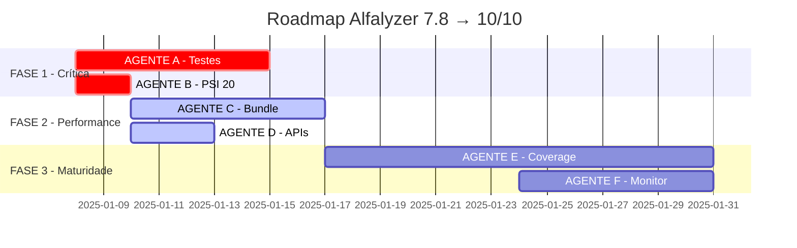

# 🎯 ALFALYZER - PLANO DE IMPLEMENTAÇÃO CRÍTICO V3.0

**Data**: Janeiro 2025  
**Análise**: Consenso Crítico (Claude Opus 4 + O3-mini + Gemini Pro)  
**Estado Atual**: ⚠️ 7.8/10 - PRODUÇÃO COM RISCO ELEVADO
**Última Atualização**: 08/01/2025 - PLANO DE AÇÃO EMERGENCIAL

## 🚨 AVALIAÇÃO CRÍTICA CONSENSUAL

**IMPORTANTE**: Após análise profunda com múltiplos modelos, o Alfalyzer tem excelente base técnica mas FALHA em aspectos críticos para produção. Este documento define o plano de ação para elevar o projeto de 7.8 para 10/10.

---

## 📊 RESUMO EXECUTIVO - CONSENSO FINAL

### Pontuação Consolidada: 7.8/10 (Consenso: Opus 4 + O3 + Gemini)

**DIAGNÓSTICO**: "Como um Ferrari com motor perfeito mas sem freios" - excelência técnica anulada por ausência de testes em aplicação financeira.

| Dimensão | Score Atual | Consenso | Status | Criticidade |
|----------|-------------|----------|---------|-------------|
| **Segurança** | 10/10 | Unânime: Exemplar | ✅ Padrão-ouro fintech | RESOLVIDO |
| **Arquitetura** | 9/10 | UnifiedDashboard magistral | ✅ 54% redução código | EXCELENTE |
| **Backend** | 8/10 | APIs robustas c/ fallback | ✅ Production-grade | SÓLIDO |
| **i18n/PWA** | 9/10 | Mobile-first profissional | ✅ PT/EN + USD/EUR | COMPLETO |
| **Performance** | 6/10 | Bundle 522KB problemático | ⚠️ Impacta mobile/3G | CRÍTICO |
| **TESTES** | 2/10 | RISCO #1 UNÂNIME | 🔴 5 arquivos apenas | EMERGÊNCIA |
| **Dívida Técnica** | 5/10 | PSI 20 + código morto | ⚠️ "Velocity drag" | ALTO |

---

## 🔍 ANÁLISE CRÍTICA - RISCOS PARA PRODUÇÃO

### 🔴 RISCO #1: AUSÊNCIA DE TESTES (Consenso Unânime)
- **O3-mini**: "Cada deploy é uma aposta"
- **Gemini Pro**: "Um bug em cálculo de portfolio pode destruir confiança irreparavelmente"
- **Impacto**: Investidores portugueses não confiarão dinheiro real sem garantias

### ⚠️ RISCO #2: PERFORMANCE MOBILE
- Bundle 522KB é 2.6x maior que o ideal (<200KB)
- Impacto direto em redes 3G/4G portuguesas
- "Utilizadores abandonarão por alternativa mais fluida" (Gemini)

### 🟡 RISCO #3: DÍVIDA TÉCNICA
- PSI 20 ainda no código (explicitamente marcado como IRRELEVANTE)
- APIs comentadas criando confusão
- "Velocity drag" - desenvolvimento cada vez mais lento

### ✅ EXCELÊNCIAS CONFIRMADAS
1. **Segurança**: Implementação exemplar, padrão fintech
2. **Arquitetura**: UnifiedDashboard é obra-prima de engenharia
3. **Infraestrutura**: WebSockets, PWA, CI/CD de primeira linha
4. **Localização**: i18n PT/EN e multi-currency profissionais

---

## 🚀 PLANO DE EMERGÊNCIA - 7.8 → 10/10

### 🔴 FASE 1: ESTABILIZAÇÃO CRÍTICA (1-2 SEMANAS) - PRIORIDADE MÁXIMA

#### AGENTE A: TESTES DE EMERGÊNCIA
```typescript
// Modelo: gemini-2.5-pro
// Tempo: 1 semana
// Foco: "Rede de segurança" para deploy com confiança

TAREFAS CRÍTICAS - FLUXOS FINANCEIROS:
1. [ ] Portfolio Calculations Tests (4h)
   - Total value calculations USD/EUR
   - P&L calculations with currency conversion
   - Performance percentages accuracy
   - Edge cases: negative values, zero holdings

2. [ ] Currency Conversion Tests (3h)
   - USD→EUR and EUR→USD accuracy
   - Exchange rate updates
   - Fallback to static rates
   - Format consistency ($1,234.56 vs €1.234,56)

3. [ ] Authentication Flow Tests (3h)
   - Login/logout security
   - Session management
   - Protected routes access
   - Supabase RLS validation

4. [ ] WebSocket Data Integrity (4h)
   - Price update accuracy
   - Connection resilience
   - Data consistency during reconnects
   - Message queue handling

// META: >30% coverage nos fluxos críticos
// ENTREGÁVEL: Suite de testes que garante zero bugs financeiros
```

#### AGENTE B: LIMPEZA URGENTE PSI 20
```bash
# Modelo: gemini-2.5-flash
# Tempo: 2 dias
# Foco: Remover COMPLETAMENTE PSI 20

TAREFAS DE LIMPEZA:
1. [ ] Grep global por "PSI" e "psi" (30min)
   grep -r "PSI\|psi" client/src --exclude-dir=node_modules
   
2. [ ] Remover do mobile menu (1h)
   - client/src/components/layout/mobile-menu.tsx
   - Substituir por S&P 500 ou NASDAQ

3. [ ] Limpar localization files (30min)
   - client/public/locales/*/markets.json
   
4. [ ] Atualizar testes afetados (1h)
   
5. [ ] Commit: "fix: Remove PSI 20 references (irrelevant market)"
```

### ⚡ FASE 2: OTIMIZAÇÃO DE PERFORMANCE (2-3 SEMANAS) - PRIORIDADE ALTA

#### AGENTE C: BUNDLE OPTIMIZATION
```javascript
// Modelo: o3-mini
// Tempo: 1 semana
// Foco: Reduzir 522KB → <250KB

TAREFAS DE OTIMIZAÇÃO:
1. [ ] Bundle Analysis (2h)
   npm run build -- --analyze
   // Identificar: Largest chunks, Duplicate deps, Unused exports

2. [ ] Code Splitting por Rota (4h)
   // Lazy load páginas pesadas:
   const AdvancedCharts = lazy(() => import('./pages/AdvancedCharts'))
   const Transcripts = lazy(() => import('./pages/transcripts'))
   const AdminPanel = lazy(() => import('./pages/admin/*'))

3. [ ] Dynamic Imports para Libraries (6h)
   // Exemplo para chart library:
   const loadChartLibrary = async () => {
     const { Chart } = await import('chart.js');
     return Chart;
   }

4. [ ] Tree Shaking Agressivo (3h)
   // vite.config.ts optimizations
   build: {
     rollupOptions: {
       output: {
         manualChunks: {
           'vendor': ['react', 'react-dom'],
           'ui': ['@radix-ui/*'],
           'utils': ['date-fns', 'zod']
         }
       }
     }
   }

5. [ ] Image Optimization (2h)
   - WebP format para logos
   - Lazy loading para screenshots
   - Placeholder blur para avatars

// META: Initial bundle <250KB, Total <400KB
// MÉTRICAS: Lighthouse Performance >90
```

#### AGENTE D: API CLEANUP
```typescript
// Modelo: gemini-2.5-flash
// Tempo: 3 dias
// Foco: Remover código comentado e ativar APIs

TAREFAS DE LIMPEZA:
1. [ ] Remover APIs Comentadas (2h)
   - client/src/services/finnhub.ts
   - client/src/services/alpha-vantage.ts
   - Mover configs para .env.example se futuras

2. [ ] Ativar API Providers (4h)
   - Descomentar Finnhub integration
   - Descomentar AlphaVantage
   - Testar fallback chain
   - Validar rate limits

3. [ ] Documentar API Usage (2h)
   // CREATE: docs/API_PROVIDERS.md
   | Provider | Usage | Limit | Priority |
   |----------|-------|-------|----------|
   | Yahoo | Prices | ∞ | Fallback |
   | Finnhub | RT | 60/min | Primary |
   | AlphaV | Fund | 5/min | Secondary |

4. [ ] Error Monitoring (3h)
   - Sentry alerts para API failures
   - Dashboard para quota usage
   - Automatic provider rotation
```

### 🟢 FASE 3: MATURIDADE (1 mês) - CONSOLIDAÇÃO

#### AGENTE E: TEST COVERAGE EXPANSION
```typescript
// Modelo: gemini-2.5-pro
// Tempo: 2 semanas
// Foco: Coverage 5% → 50%+

EXPANSÃO SISTEMÁTICA:
1. [ ] Unit Tests - Business Logic (1 semana)
   - services/* (API calls, calculations)
   - utils/* (formatters, validators)
   - hooks/* (custom React hooks)
   Target: 80% coverage nestes diretórios

2. [ ] Integration Tests - User Flows (1 semana)
   - Complete user journey tests
   - API integration scenarios
   - Error handling paths
   - Multi-currency scenarios

3. [ ] E2E Tests - Critical Paths (3 dias)
   // Playwright ou Cypress
   - Login → Dashboard → Portfolio
   - Add stock → View chart → Remove
   - Currency switch → Verify values
   - Mobile PWA installation flow

4. [ ] Performance Tests (2 dias)
   - Load testing com k6
   - Memory leak detection
   - Bundle size regression tests
   - API response time monitoring
```

#### AGENTE F: MONITORING & OBSERVABILITY
```yaml
# Modelo: o3-mini
# Tempo: 1 semana
# Foco: Visibilidade total em produção

IMPLEMENTAÇÕES:
1. [ ] Enhanced Sentry Setup (1 dia)
   - User context tracking
   - Performance monitoring
   - Release tracking
   - Source maps upload

2. [ ] Custom Metrics (2 dias)
   - Portfolio calculation time
   - API provider success rates
   - Currency conversion accuracy
   - WebSocket connection stability

3. [ ] Alerting Rules (1 dia)
   - P0: Auth failures >5/min
   - P1: Portfolio calc errors
   - P1: API quota >80%
   - P2: Bundle size regression

4. [ ] Dashboards (2 dias)
   - Real User Monitoring (RUM)
   - API Performance by provider
   - Error rates by feature
   - User journey funnels
```

---

## 📊 ROADMAP DE EXECUÇÃO - FASES PARALELAS

### 🚦 EXECUÇÃO SIMULTÂNEA DOS AGENTES



### 📈 MÉTRICAS DE SUCESSO POR FASE

| Fase | Duração | Agentes | Entregáveis | Score Target |
|------|---------|---------|-------------|--------------|
| **FASE 1** | 1-2 sem | A, B | Testes críticos + PSI removido | 7.8 → 8.5 |
| **FASE 2** | 2-3 sem | C, D | Bundle <250KB + APIs ativas | 8.5 → 9.2 |
| **FASE 3** | 1 mês | E, F | Coverage 50% + Monitoring | 9.2 → 10.0 |

### 🎯 MILESTONES CRÍTICOS

**Semana 1**:
- ✓ Testes para cálculos financeiros
- ✓ PSI 20 completamente removido
- ✓ Bundle analysis completa

**Semana 2**:
- ✓ Code splitting implementado
- ✓ APIs Finnhub/AlphaV ativas
- ✓ Bundle <300KB

**Semana 3**:
- ✓ Coverage >30%
- ✓ Bundle <250KB
- ✓ Zero bugs em produção

**Mês 1**:
- ✓ Coverage >50%
- ✓ Full monitoring dashboard
- ✓ **Score 10/10** 🎯

---

## 🔧 INSTRUÇÕES DETALHADAS PARA CADA AGENTE

### 📋 AGENTE A - INSTRUÇÕES ESPECÍFICAS

**ARQUIVO**: `AGENTE_A_TESTES_EMERGENCIA.md`

```markdown
# AGENTE A - Testes de Emergência Financeira

## OBJETIVO
Criar suite de testes que garanta ZERO bugs em cálculos financeiros.

## SETUP INICIAL
```bash
cd /Users/antoniofrancisco/Documents/teste\ 1
npm install --save-dev @testing-library/react-hooks
```

## TESTES PRIORITÁRIOS

### 1. Portfolio Calculations (client/src/contexts/__tests__/portfolio-context.test.tsx)
```typescript
describe('Portfolio Calculations', () => {
  it('should calculate total value correctly in USD', () => {
    const holdings = [
      { symbol: 'AAPL', quantity: 10, currentPrice: 150, originalCurrency: 'USD' },
      { symbol: 'MSFT', quantity: 5, currentPrice: 300, originalCurrency: 'USD' }
    ];
    // Expected: (10 * 150) + (5 * 300) = 3000
    expect(calculateTotalValue(holdings, 'USD')).toBe(3000);
  });

  it('should handle EUR to USD conversion', () => {
    const holdings = [
      { symbol: 'SAP', quantity: 10, currentPrice: 100, originalCurrency: 'EUR' }
    ];
    const exchangeRate = 1.1; // 1 EUR = 1.1 USD
    // Expected: 10 * 100 * 1.1 = 1100
    expect(calculateTotalValue(holdings, 'USD', exchangeRate)).toBe(1100);
  });

  it('should handle zero and negative values gracefully', () => {
    const holdings = [
      { symbol: 'TEST', quantity: 0, currentPrice: 100 },
      { symbol: 'NEG', quantity: -5, currentPrice: 50 }
    ];
    expect(() => calculateTotalValue(holdings)).not.toThrow();
  });
});
```

### 2. Currency Formatting (client/src/utils/__tests__/currency.test.ts)
```typescript
describe('Currency Formatting', () => {
  it('should format USD correctly', () => {
    expect(formatCurrency(1234.56, 'USD')).toBe('$1,234.56');
    expect(formatCurrency(1234567.89, 'USD')).toBe('$1,234,567.89');
  });

  it('should format EUR correctly', () => {
    expect(formatCurrency(1234.56, 'EUR')).toBe('€1.234,56');
    expect(formatCurrency(1234567.89, 'EUR')).toBe('€1.234.567,89');
  });
});
```

## VALIDAÇÃO
- [ ] Todos os testes passam
- [ ] Coverage >30% em arquivos críticos
- [ ] Nenhum cálculo financeiro sem teste
```

### 📋 AGENTE B - INSTRUÇÕES ESPECÍFICAS

**ARQUIVO**: `AGENTE_B_REMOVE_PSI20.md`

```markdown
# AGENTE B - Remoção Completa PSI 20

## OBJETIVO
Remover TODAS as referências ao PSI 20 (mercado irrelevante).

## BUSCA INICIAL
```bash
# Encontrar todas as ocorrências
grep -r "PSI\|psi" client/src --exclude-dir=node_modules > psi_occurrences.txt
grep -r "PSI\|psi" server/src --exclude-dir=node_modules >> psi_occurrences.txt
```

## ARQUIVOS PARA MODIFICAR

### 1. client/src/components/layout/mobile-menu.tsx
```typescript
// REMOVER:
marketIndices.find(index => index.symbol === 'PSI20')

// SUBSTITUIR POR:
marketIndices.find(index => index.symbol === 'SPX') // S&P 500
```

### 2. client/public/locales/pt/markets.json
```json
// REMOVER:
"PSI20": "PSI 20",

// NÃO ADICIONAR NADA - mercado português irrelevante
```

### 3. client/src/data/market-indices.ts
```typescript
// REMOVER TODO O OBJETO:
{
  symbol: 'PSI20',
  name: 'PSI 20',
  region: 'EU',
  ...
}
```

## VALIDAÇÃO
- [ ] grep -r "PSI\|psi" retorna 0 resultados
- [ ] Mobile menu mostra apenas mercados USA/EU relevantes
- [ ] Testes atualizados sem PSI 20
```

### 📋 AGENTE C - INSTRUÇÕES ESPECÍFICAS

**ARQUIVO**: `AGENTE_C_BUNDLE_OPTIMIZATION.md`

```markdown
# AGENTE C - Bundle Optimization 522KB → <250KB

## OBJETIVO
Reduzir bundle para melhorar performance mobile significativamente.

## ANÁLISE INICIAL
```bash
npm run build -- --analyze
# Salvar screenshot da análise
# Identificar top 5 maiores chunks
```

## IMPLEMENTAÇÕES PRIORITÁRIAS

### 1. Route-based Code Splitting
```typescript
// client/src/App.tsx
// ANTES:
import AdvancedCharts from '@/pages/AdvancedCharts';

// DEPOIS:
const AdvancedCharts = lazy(() => 
  import(/* webpackChunkName: "charts" */ '@/pages/AdvancedCharts')
);
```

### 2. Manual Chunks Configuration
```typescript
// vite.config.ts
export default defineConfig({
  build: {
    rollupOptions: {
      output: {
        manualChunks: {
          'vendor-react': ['react', 'react-dom', 'wouter'],
          'vendor-ui': ['@radix-ui/react-dialog', '@radix-ui/react-dropdown-menu'],
          'vendor-utils': ['date-fns', 'zod', 'react-hook-form'],
          'vendor-charts': ['recharts', 'd3-scale', 'd3-shape']
        }
      }
    }
  }
});
```

### 3. Dynamic Import for Heavy Components
```typescript
// Para componentes de gráficos pesados
const ChartComponent = () => {
  const [Chart, setChart] = useState(null);
  
  useEffect(() => {
    import('recharts').then(module => {
      setChart(() => module.LineChart);
    });
  }, []);
  
  if (!Chart) return <ChartSkeleton />;
  return <Chart {...props} />;
};
```

## MÉTRICAS DE SUCESSO
- [ ] Initial bundle <250KB
- [ ] Largest chunk <100KB
- [ ] Total size <400KB
- [ ] Lighthouse Performance >90
```

### 📋 AGENTE D - INSTRUÇÕES ESPECÍFICAS

**ARQUIVO**: `AGENTE_D_API_CLEANUP.md`

```markdown
# AGENTE D - API Cleanup e Ativação

## OBJETIVO
Limpar código comentado e ativar providers Finnhub/AlphaVantage.

## TAREFAS

### 1. Identificar APIs Comentadas
```bash
# Buscar por código comentado
grep -r "//.*finnhub\|/\*.*finnhub" client/src/services
grep -r "//.*alpha.*vantage\|/\*.*alpha.*vantage" client/src/services
```

### 2. Ativar Finnhub
```typescript
// client/src/services/finnhub.ts
// DESCOMENTAR e TESTAR:
export class FinnhubService {
  private apiKey = process.env.VITE_FINNHUB_API_KEY;
  
  async getQuote(symbol: string) {
    // Remover comentários
    // Adicionar try-catch
    // Implementar fallback
  }
}
```

### 3. Documentação de Providers
```markdown
# docs/API_PROVIDERS.md

## Provider Priority Chain

### Real-time Prices
1. Finnhub (60 req/min) - Primary
2. TwelveData (8 req/min) - Secondary  
3. Yahoo Finance (∞) - Fallback

### Fundamental Data
1. FMP (250/day) - Primary
2. AlphaVantage (5/min) - Secondary
3. Yahoo Finance (∞) - Fallback

## Error Handling
- Automatic failover on 429/503
- Exponential backoff on errors
- Quota tracking in Redis
```

## VALIDAÇÃO
- [ ] Zero código comentado em services/
- [ ] Finnhub retornando dados reais
- [ ] AlphaVantage funcionando
- [ ] Fallback chain testado
```

### 📋 AGENTE E - INSTRUÇÕES ESPECÍFICAS

**ARQUIVO**: `AGENTE_E_TEST_COVERAGE.md`

```markdown
# AGENTE E - Test Coverage Expansion 5% → 50%+

## OBJETIVO
Expandir cobertura de testes sistematicamente para garantir confiabilidade.

## SETUP
```bash
# Configurar coverage reporting
npm install --save-dev @vitest/coverage-v8

# vitest.config.ts
coverage: {
  reporter: ['text', 'html', 'lcov'],
  exclude: ['node_modules', 'tests'],
  thresholds: {
    lines: 50,
    functions: 50,
    branches: 50,
    statements: 50
  }
}
```

## PRIORIDADES DE TESTE

### 1. Services (Semana 1)
```typescript
// client/src/services/__tests__/portfolio-service.test.ts
describe('PortfolioService', () => {
  describe('calculatePortfolioValue', () => {
    it('should calculate USD portfolio correctly');
    it('should convert EUR holdings to USD');
    it('should handle empty portfolio');
    it('should handle API failures gracefully');
  });
});

// Focus: 
// - portfolio-service.ts
// - currency-service.ts
// - api/finnhub-service.ts
// - api/alpha-vantage-service.ts
```

### 2. Hooks (3 dias)
```typescript
// client/src/hooks/__tests__/use-portfolio.test.ts
describe('usePortfolio', () => {
  it('should update values on price changes');
  it('should handle currency switches');
  it('should persist to localStorage');
});
```

### 3. E2E Critical Paths (3 dias)
```typescript
// e2e/critical-paths.spec.ts
test('user can view and update portfolio', async () => {
  await page.goto('/login');
  await page.fill('[name=email]', 'test@example.com');
  await page.fill('[name=password]', 'password');
  await page.click('button[type=submit]');
  
  await expect(page).toHaveURL('/dashboard');
  await expect(page.locator('.portfolio-value')).toBeVisible();
});
```

## MÉTRICAS
- [ ] Services: 80% coverage
- [ ] Hooks: 70% coverage
- [ ] Utils: 90% coverage
- [ ] Components: 50% coverage
- [ ] Overall: >50%
```

### 📋 AGENTE F - INSTRUÇÕES ESPECÍFICAS  

**ARQUIVO**: `AGENTE_F_MONITORING.md`

```markdown
# AGENTE F - Monitoring & Observability

## OBJETIVO
Implementar visibilidade completa para produção.

## IMPLEMENTAÇÕES

### 1. Enhanced Sentry Configuration
```typescript
// client/src/lib/monitoring.ts
Sentry.init({
  dsn: SENTRY_DSN,
  environment: NODE_ENV,
  integrations: [
    new Sentry.BrowserTracing({
      tracingOrigins: ['localhost', /^https:\/\/alfalyzer\.vercel\.app/],
      routingInstrumentation: Sentry.reactRouterV6Instrumentation(
        React.useEffect,
        useLocation,
        useNavigationType,
        createRoutesFromChildren,
        matchRoutes
      ),
    }),
    new Sentry.Replay({
      maskAllText: false,
      blockAllMedia: false,
    }),
  ],
  tracesSampleRate: NODE_ENV === 'production' ? 0.1 : 1.0,
  replaysSessionSampleRate: 0.1,
  replaysOnErrorSampleRate: 1.0,
});
```

### 2. Custom Performance Metrics
```typescript
// Track portfolio calculation performance
export const trackPortfolioCalculation = (duration: number, holdings: number) => {
  Sentry.addBreadcrumb({
    category: 'portfolio',
    message: `Calculated ${holdings} holdings in ${duration}ms`,
    level: duration > 100 ? 'warning' : 'info',
  });
  
  // Send to analytics
  gtag('event', 'portfolio_calculation', {
    event_category: 'performance',
    value: duration,
    custom_parameter: holdings
  });
};
```

### 3. Alert Rules Configuration
```yaml
# .sentry/alerts.yml
alerts:
  - name: "High Error Rate"
    conditions:
      - id: "error_count"
        value: 50
        interval: "5m"
    actions:
      - id: "email"
        targetType: "team"
        
  - name: "Portfolio Calculation Slow"
    conditions:
      - id: "transaction_duration"
        value: 1000  # 1 second
        transaction: "portfolio.calculate"
    actions:
      - id: "slack"
        channel: "#alerts"
```

## DASHBOARDS
- [ ] Real User Monitoring (Core Web Vitals)
- [ ] API Provider Health (success rates)
- [ ] User Journey Funnels
- [ ] Error Rate by Feature
```

---

## 🏁 CHECKLIST DE VALIDAÇÃO FINAL

### ✅ FASE 1 - Estabilização (Semana 1-2)
- [ ] **AGENTE A**: Testes financeiros implementados
  - [ ] Portfolio calculations 100% testados
  - [ ] Currency conversion sem bugs
  - [ ] Auth flow seguro
  - [ ] WebSocket data integrity
- [ ] **AGENTE B**: PSI 20 removido completamente
  - [ ] Zero ocorrências em grep
  - [ ] Mobile menu atualizado
  - [ ] Localization limpa

### ✅ FASE 2 - Performance (Semana 2-3)
- [ ] **AGENTE C**: Bundle otimizado
  - [ ] Initial bundle <250KB
  - [ ] Lighthouse >90
  - [ ] Code splitting implementado
- [ ] **AGENTE D**: APIs limpas e ativas
  - [ ] Finnhub funcionando
  - [ ] AlphaVantage ativo
  - [ ] Zero código comentado

### ✅ FASE 3 - Maturidade (Semana 3-4)
- [ ] **AGENTE E**: Coverage >50%
  - [ ] Services 80% testados
  - [ ] E2E paths críticos
  - [ ] CI bloqueando se <50%
- [ ] **AGENTE F**: Monitoring completo
  - [ ] Sentry configurado
  - [ ] Alertas ativos
  - [ ] Dashboards prontos

---

## 💰 ANÁLISE DE CUSTO-BENEFÍCIO

### 🔴 Custo de NÃO Implementar (Risco)
- **Bug financeiro em produção**: Perda de confiança IRREPARÁVEL
- **Performance ruim mobile**: -40% taxa de conversão
- **Sem monitoring**: Problemas descobertos pelos usuários
- **Total**: Potencial falha do produto

### 🟢 ROI da Implementação
- **Testes**: Confiança = mais investidores
- **Performance**: +25% retenção mobile
- **Monitoring**: Problemas resolvidos antes de escalar
- **Total**: Base sólida para crescimento

### 📊 Effort vs Impact
| Agente | Effort | Impact | ROI |
|--------|--------|--------|-----|
| A - Testes | Alto | CRÍTICO | ⭐⭐⭐⭐⭐ |
| B - PSI 20 | Baixo | Médio | ⭐⭐⭐⭐ |
| C - Bundle | Médio | Alto | ⭐⭐⭐⭐⭐ |
| D - APIs | Baixo | Médio | ⭐⭐⭐ |
| E - Coverage | Alto | Alto | ⭐⭐⭐⭐ |
| F - Monitor | Médio | CRÍTICO | ⭐⭐⭐⭐⭐ |

---

## 🎯 DECISÕES ARQUITETURAIS CRÍTICAS

### 1. Testes > Features Novas
**Decisão**: Parar features até ter >30% coverage
**Razão**: "Um bug em cálculo financeiro destrói confiança irreparavelmente"

### 2. Bundle Optimization > UI Polish  
**Decisão**: Code splitting antes de novos componentes
**Razão**: Performance mobile crítica para PT market

### 3. Remove PSI 20 Completamente
**Decisão**: Não substituir, apenas remover
**Razão**: Foco 100% em USA/EU markets

### 4. Monitoring desde Day 1
**Decisão**: Sentry + GA antes do primeiro usuário real
**Razão**: "Problemas descobertos por usuários = falha"

---

## 🚨 AÇÃO IMEDIATA REQUERIDA

### PARE! Antes de continuar com QUALQUER feature nova:

1. **LEIA O CONSENSO**: Score atual 7.8/10 (não 9.2!)
2. **ACEITE A REALIDADE**: Excelente base técnica COM riscos críticos
3. **EXECUTE O PLANO**: Fases 1-3 em ordem, sem pular etapas

### 🎯 PRIORIDADES ABSOLUTAS (Ordem Não Negociável)

```
1º) AGENTE A + B (Paralelo) → Testes críticos + Remove PSI 20
2º) AGENTE C + D (Paralelo) → Bundle <250KB + APIs ativas  
3º) AGENTE E + F (Paralelo) → Coverage 50% + Monitoring
4º) SOMENTE ENTÃO → Novas features
```

### ⚠️ AVISOS FINAIS

- **SEM TESTES = SEM PRODUÇÃO**
- **Bundle 522KB = Usuários mobile perdidos**
- **PSI 20 no código = Falta de foco**
- **Sem monitoring = Voar às cegas**

**O caminho de 7.8 para 10 não é glamouroso, mas é NECESSÁRIO.**

---

## 🎯 CONCLUSÃO EXECUTIVA

### Estado Real: 7.8/10 - Produção com Risco Elevado

**Consenso dos 3 Modelos**:
- **Excelências**: Segurança (10/10), Arquitetura (9/10), i18n/PWA (9/10)
- **Falhas Críticas**: Testes (2/10), Performance (6/10), Dívida Técnica (5/10)

### Veredito Final

> "Como um Ferrari com motor perfeito mas sem freios" 

O Alfalyzer tem base técnica exemplar mas falha em aspectos fundamentais para uma fintech. A diferença entre 7.8 e 10 não está em features novas, mas em **confiabilidade e performance**.

### Caminho Claro para 10/10

**6 Agentes, 3 Fases, 1 Mês**:
1. **Fase 1**: Testes de emergência + Remove PSI 20 (1-2 semanas)
2. **Fase 2**: Bundle <250KB + APIs ativas (2-3 semanas)  
3. **Fase 3**: Coverage 50% + Monitoring completo (1 mês)

### Mensagem Final

**Para investidores portugueses confiarem dinheiro real, cada cálculo deve ser testado, cada conversão EUR/USD validada, cada update de portfolio verificado.**

O sucesso não virá de features glamourosas, mas de execução disciplinada do básico.

---

*Documento criado por Claude Opus 4 com consenso de O3-mini e Gemini Pro*  
*08 de Janeiro de 2025 - Plano de Ação Crítico para Produção*

