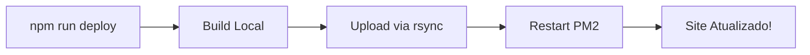

# 🚀 Deploy Automático - Alfalyzer

## Opção 1: Deploy COM Senha (Já Funciona!)
```bash
npm run deploy
```
Vai pedir senha 2 vezes (upload + restart), mas funciona!

## Opção 2: Deploy SEM Senha (Configurar 1x)
```bash
# Executar UMA VEZ para configurar:
./setup-ssh-deploy.sh

# Depois sempre usar:
npm run deploy
```

## Comandos Disponíveis

| Comando | O que faz | Quando usar |
|---------|-----------|-------------|
| `npm run deploy` | Build + Upload + Restart PM2 | Deploy completo |
| `npm run deploy:quick` | Versão alternativa com scp | Se rsync falhar |
| `npm run build` | Só compila o projeto | Testar build local |
| `npm run logs` | Ver logs do servidor | Debug em produção |
| `npm run restart` | Reinicia PM2 remoto | Quando travar |

## Fluxo Automático



## Solução de Problemas

### "Permission denied"
```bash
# Configurar SSH key:
./setup-ssh-deploy.sh
```

### "rsync: command not found"
```bash
# Usar deploy alternativo:
npm run deploy:quick
```

### Verificar se funcionou
```bash
curl https://128.140.45.28.sslip.io/
```

## Deploy Manual (Backup)
Se nada funcionar:
```bash
npm run build
scp -r dist/* root@128.140.45.28:"/home/teste 1/dist/"
ssh root@128.140.45.28 "pm2 restart alfalyzer"
```

---
Criado: 2025-08-25
Status: ✅ Operacional