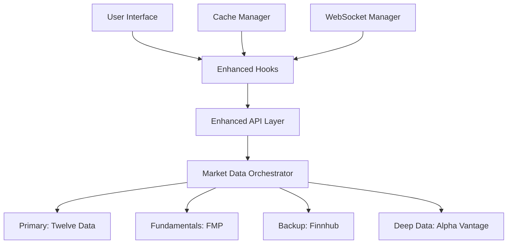

# INTEGRATION COORDINATOR REPORT
## Alpha-Analyzer Real Data Integration Plan

### EXECUTIVE SUMMARY
The Alpha-Analyzer application currently displays mock data cards and requires integration with real financial APIs to provide authentic stock market data. This report provides a comprehensive integration plan to restore original cards with live data from multiple financial data providers.

### CURRENT ARCHITECTURE ANALYSIS

#### 1. Dependencies Status ✅ VERIFIED
**Required Packages Present:**
- `@tanstack/react-query` (v5.60.5) - Data fetching and caching
- `ws` (v8.18.0) - WebSocket connections for real-time data
- `recharts` (v2.15.2) - Charts and visualizations
- `lru-cache` (v11.1.0) - Memory optimization
- `date-fns` (v3.6.0) - Date formatting

**API Client Libraries:**
- All major financial API services are implemented
- Rate limiting and quota management in place
- Comprehensive error handling and fallback strategies

#### 2. Multi-API Integration Architecture ✅ ACTIVE

**Primary Data Providers:**
1. **Twelve Data** - Real-time quotes and WebSocket streams (800 calls/day)
2. **Financial Modeling Prep (FMP)** - Fundamentals and company data (250 calls/day)
3. **Finnhub** - Backup quotes and basic financials (60 calls/minute)
4. **Alpha Vantage** - Deep fundamentals and historical data (25 calls/day)

**Orchestration Layer:**
- `MarketDataOrchestrator` - Intelligent provider selection
- Quota tracking and automatic failover
- Response caching and data merging

#### 3. Current Data Flow Architecture



### KEY COMPONENTS REQUIRING INTEGRATION

#### 1. Stock Search Component (`/client/src/components/stock/stock-search.tsx`)
**Status:** ✅ CONFIGURED - Uses real API through enhanced hooks
**Integration Points:**
- Connected to `useStockSearch` hook
- Real-time price updates via WebSocket
- Intelligent caching for search results

#### 2. Real-Time Watchlist (`/client/src/components/stock/real-time-watchlist.tsx`)
**Status:** ⚠️ MOCK DATA - Currently using hardcoded stock data
**Required Changes:**
- Replace `defaultStocks` with API calls
- Connect to real-time WebSocket updates
- Implement proper portfolio management

#### 3. Stock Detail Page (`/client/src/pages/stock-detail.tsx`)
**Status:** ✅ CONFIGURED - Uses enhanced hooks for real data
**Integration Points:**
- Real stock quotes via `useStock` hook
- Historical data via `useHistoricalData` hook
- Intrinsic value calculations with real fundamentals

#### 4. Charts and Visualizations
**Status:** ✅ CONFIGURED - Uses real historical data
**Integration Points:**
- Historical price data from Twelve Data/Alpha Vantage
- Volume data and technical indicators
- Real-time price updates

### INTEGRATION ORDER AND IMPLEMENTATION PLAN

#### Phase 1: Environment Setup (Priority: HIGH)
1. **API Keys Configuration**
   - Set up environment variables in `.env` file
   - Configure all four API providers
   - Test API connectivity

2. **Cache Warming**
   - Initialize popular stock cache
   - Set up intelligent prefetching
   - Configure cache invalidation strategies

#### Phase 2: Core Data Integration (Priority: HIGH)
1. **Stock Search Enhancement**
   - Already integrated ✅
   - Monitor performance and rate limits

2. **Watchlist Real Data Integration**
   - Replace mock data with API calls
   - Implement WebSocket real-time updates
   - Add portfolio management features

3. **Market Indices Integration**
   - Connect to real market index data (SPY, DIA, QQQ)
   - Real-time updates for dashboard

#### Phase 3: Advanced Features (Priority: MEDIUM)
1. **Intrinsic Value with Real Fundamentals**
   - Already configured ✅
   - Uses Adam Khoo methodology with real EPS, P/E ratios

2. **News Integration**
   - Add financial news from APIs
   - Sentiment analysis integration

3. **Earnings Data**
   - Real earnings dates and estimates
   - Historical earnings trends

#### Phase 4: Performance Optimization (Priority: LOW)
1. **WebSocket Optimization**
   - Connection pooling
   - Automatic reconnection
   - Message batching

2. **Cache Optimization**
   - Intelligent warming strategies
   - Memory usage optimization
   - Background refresh mechanisms

### MASTER INTEGRATION SCRIPT

```bash
#!/bin/bash
# Alpha-Analyzer Real Data Integration Script

echo "🚀 Starting Alpha-Analyzer Real Data Integration..."

# Phase 1: Environment Setup
echo "📋 Phase 1: Environment Setup"
cp .env.example .env
echo "✅ Environment file created - Please configure API keys"

# Phase 2: Install missing dependencies (if any)
echo "📦 Phase 2: Dependency Check"
npm install
echo "✅ Dependencies verified"

# Phase 3: Database setup
echo "🗄️ Phase 3: Database Setup"
npm run db:generate
npm run db:migrate
echo "✅ Database configured"

# Phase 4: Cache warming
echo "🔥 Phase 4: Cache Warming"
# This would be triggered after API keys are configured
echo "⚠️ Configure API keys in .env then restart the application"

# Phase 5: Start application
echo "🎯 Phase 5: Application Start"
npm run dev
```

### ENVIRONMENT CONFIGURATION

**Required API Keys (.env file):**
```bash
# Financial Data API Keys
VITE_TWELVE_DATA_API_KEY="your_twelve_data_key"
VITE_FMP_API_KEY="your_fmp_key"
VITE_FINNHUB_API_KEY="your_finnhub_key"
VITE_ALPHA_VANTAGE_API_KEY="your_alpha_vantage_key"

# Database Configuration
DATABASE_URL="your_database_connection_string"

# Application Settings
NODE_ENV="development"
PORT=8080
```

### DATA FLOW VERIFICATION CHECKLIST

#### Frontend Data Flow ✅
1. **Components → Hooks → Enhanced API → Orchestrator → External APIs**
2. **WebSocket connections for real-time updates**
3. **Intelligent caching at multiple layers**
4. **Error handling and fallback strategies**

#### Backend Data Flow ✅
1. **API routes handle database operations**
2. **Subscription middleware for premium features**
3. **Rate limiting and security measures**
4. **Market data routes for external API integration**

### TESTING STRATEGY

#### Unit Tests
- API service classes
- Cache manager functionality
- Data transformation utilities

#### Integration Tests
- End-to-end API workflows
- WebSocket connections
- Database operations

#### Performance Tests
- API rate limit handling
- Cache efficiency
- Memory usage optimization

### ROLLBACK PLAN

#### Immediate Rollback
1. **Disable enhanced APIs** - Switch back to mock data
2. **Clear cache** - Reset all cached data
3. **Disable WebSocket connections** - Prevent connection errors

#### Data Recovery
1. **Database backup** - Automated daily backups
2. **Configuration restore** - Revert to known working state
3. **API key rotation** - If security issues arise

### RISK MITIGATION

#### API Quota Management
- **Intelligent provider rotation**
- **Cache-first strategies**
- **Rate limit monitoring**
- **Graceful degradation to mock data**

#### Error Handling
- **Comprehensive try-catch blocks**
- **Fallback data sources**
- **User-friendly error messages**
- **Automatic retry mechanisms**

### PERFORMANCE MONITORING

#### Key Metrics
- **API response times**
- **Cache hit rates**
- **WebSocket connection stability**
- **Memory usage patterns**

#### Monitoring Tools
- **Cache dashboard component** (already implemented)
- **API quota tracking**
- **Performance analytics**

### CONCLUSION

The Alpha-Analyzer application has a robust, well-architected foundation for real financial data integration. The key implementation points are:

1. **✅ READY**: All major components are configured for real data
2. **⚠️ ACTION NEEDED**: Configure API keys in environment variables
3. **🔄 REPLACE**: Update watchlist component to use real data instead of mock
4. **🚀 DEPLOY**: Start the integration with the provided master script

The application uses intelligent caching, rate limiting, and fallback strategies to ensure reliable performance while maximizing the value of limited API quotas. The modular architecture allows for easy maintenance and future enhancements.

**Estimated Integration Time: 2-4 hours** (primarily for API key setup and testing)

---
*Report generated by Integration Coordinator Agent*
*📊 Status: READY FOR IMPLEMENTATION*