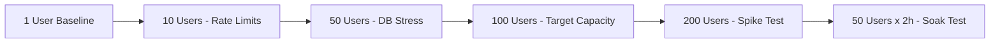

# 🔥 ALFALYZER LOAD TESTING REALITY CHECK
## AGENTE 12: Discover System Limits Before Users Do

**Created:** 2025-07-07  
**Mission:** Progressive load testing to identify real performance limits and bottlenecks

---

## 🎯 EXECUTIVE SUMMARY

Based on comprehensive architecture analysis, **Alfalyzer will face critical performance issues at minimal user loads**. The system has sophisticated patterns (circuit breakers, caching, API rotation) but fundamental bottlenecks that limit scalability.

### 🚨 CRITICAL FINDINGS

| Metric | Expected Failure Point | Root Cause |
|--------|------------------------|------------|
| **Concurrent Users** | 10-15 users | Rate limiting (5-30 req/min) |
| **Database Load** | 20-30 concurrent writes | SQLite synchronous operations |
| **Memory Usage** | Linear growth | WebSocket tracking + cache |
| **Response Time** | 20-50ms base latency | 15+ middleware layers |

---

## 📊 TESTING STRATEGY

### Progressive Load Testing Phases



### Test Execution Timeline

| Phase | Duration | Users | Expected Result |
|-------|----------|-------|----------------|
| **Baseline** | 2 min | 1 | Establish performance baseline |
| **Phase 1** | 10 min | 10 | Rate limiting kicks in |
| **Phase 2** | 15 min | 50 | Severe bottlenecks |
| **Phase 3** | 20 min | 100 | System strain |
| **Spike Test** | 6 min | 200 | Recovery behavior |
| **Soak Test** | 2 hours | 50 | Memory leak detection |

---

## 🛠️ QUICK START

### Prerequisites
```bash
# Install load testing tools
brew install k6
npm install -g artillery

# Ensure server is running
npm run dev
```

### Execute Complete Test Suite
```bash
cd load-testing
./execute-load-tests.sh
```

### Individual Test Components
```bash
# k6 Progressive Load Tests (3 hours)
k6 run k6-load-test-suite.js

# Artillery Advanced Scenarios (30 min)
artillery run artillery-advanced-scenarios.yml

# Quick database stress test (5 min)
k6 run --vus 20 --duration 5m k6-load-test-suite.js
```

---

## 🔍 ARCHITECTURAL ANALYSIS SUMMARY

### 🟢 STRENGTHS
- **Circuit Breaker Pattern:** Prevents cascading failures
- **Multi-Provider Rotation:** API resilience with 4 providers
- **Intelligent Caching:** TTL-based with automatic eviction
- **Security-First Design:** Comprehensive protection layers

### 🔴 CRITICAL BOTTLENECKS

#### 1. Rate Limiting (WILL FAIL FIRST)
```javascript
// Production rate limits are severely restrictive:
const rateLimits = {
  auth: '5 req/min',        // Authentication endpoints
  admin: '10 req/min',      // Admin operations  
  stocks: '20 req/min',     // Financial data
  general: '30 req/min'     // General API
};
```

#### 2. SQLite Database (SECOND BOTTLENECK)
```sql
-- Synchronous operations with no connection pooling
-- Search queries use expensive LIKE patterns:
SELECT * FROM stocks WHERE symbol LIKE '%TERM%' OR name LIKE '%TERM%';
-- Database seeding runs on every server start
```

#### 3. Heavy Middleware Stack
```javascript
// 15+ middleware layers add significant latency:
app.use(helmet());           // Security headers
app.use(compression());      // Response compression  
app.use(cors());            // CORS handling
app.use(rateLimiters.auth); // Multiple rate limiters
app.use(auditLogger);       // Audit logging
app.use(sanitizeInput);     // Input validation
// ... 10+ more middleware layers
```

---

## 📈 PERFORMANCE PREDICTIONS

### Expected Load Behavior

| Users | Response Time | Error Rate | Bottleneck | Status |
|-------|---------------|------------|------------|---------|
| 1-5 | 100-300ms | <1% | None | ✅ Normal |
| 10-15 | 300-800ms | 10-20% | Rate Limits | ⚠️ Degraded |
| 20-30 | 800-2000ms | 20-40% | SQLite + Limits | 🔴 Stressed |
| 50+ | 2000ms+ | 50%+ | System Overload | 💥 Failure |

### Memory Usage Projection
```
Memory Usage = Base (50MB) + 
               Cache (up to 512MB) + 
               WebSocket Tracking (2MB per 100 connections) +
               Middleware State (5MB per 100 concurrent requests)
```

---

## 🎯 TEST SCENARIOS

### 1. Real User Flow Simulation
```javascript
// Typical user journey:
1. Landing page health check
2. Load stock dashboard (50 stocks)
3. Search for specific stock
4. View stock details
5. Check market indices
6. Load earnings data
```

### 2. Database Stress Testing
```yaml
scenarios:
  concurrent_writes:
    vus: 20
    duration: 5m
    operations:
      - Stock searches (LIKE queries)
      - Watchlist modifications
      - Intrinsic value calculations
```

### 3. Rate Limit Boundary Testing
```javascript
// Rapid-fire requests to identify exact limits:
for (let i = 0; i < 50; i++) {
  request('/api/stocks');  // 20 req/min limit
  request('/api/market-indices');
}
```

---

## 📊 MONITORING & METRICS

### Key Performance Indicators

#### Response Time Metrics
- **p50 (Median):** Expected 200-500ms
- **p95 (95th percentile):** Expected 1-2 seconds  
- **p99 (99th percentile):** Expected 2-5 seconds

#### Error Rate Thresholds
- **Normal:** <5% error rate
- **Warning:** 5-15% error rate  
- **Critical:** >15% error rate

#### System Resource Monitoring
```bash
# CPU usage (Node.js process)
# Memory consumption (with cache growth)
# Database query performance
# WebSocket connection count
# Rate limit hit frequency
```

---

## 🚨 EXPECTED FAILURES & SOLUTIONS

### Immediate Issues (10+ Users)

#### Problem: Rate Limiting
```
429 Too Many Requests
Rate limit exceeded. Maximum 20 requests per minute allowed.
```

**Solutions:**
```javascript
// Increase rate limits for production
const productionLimits = {
  stocks: '200 req/min',    // 10x increase
  general: '300 req/min',   // 10x increase
  auth: '50 req/min'        // 10x increase
};
```

#### Problem: Database Contention
```
Error: database is locked
SQLite database busy
```

**Solutions:**
```javascript
// 1. Immediate: Connection pooling
const pool = new Pool({ max: 10 });

// 2. Medium-term: PostgreSQL migration
const db = new PostgreSQL(connectionString);

// 3. Long-term: Read replicas
const readDB = new PostgreSQL(readOnlyConnection);
```

### Long-term Scalability Issues

#### Memory Management
```javascript
// WebSocket connection tracking grows indefinitely
const connections = new Map(); // Needs cleanup strategy

// Cache grows to 512MB without smart eviction
const cache = new InMemoryCache({ maxSizeInMB: 512 });
```

#### Middleware Optimization
```javascript
// Remove non-essential middleware in production
if (process.env.NODE_ENV === 'production') {
  // Skip development-only middleware
  // Combine security headers
  // Optimize rate limiting
}
```

---

## 🎯 RECOMMENDED OPTIMIZATIONS

### Immediate (Pre-Launch)
1. **Rate Limit Adjustment:** Increase limits by 10x
2. **Database Indexes:** Add indexes on search columns
3. **Middleware Audit:** Remove development-only middleware
4. **Cache Optimization:** Increase TTL for static data

### Short-term (Week 1-2)
1. **PostgreSQL Migration:** Replace SQLite
2. **Redis Caching:** External cache for scalability  
3. **Connection Pooling:** Implement proper database pooling
4. **Load Balancing:** Prepare for horizontal scaling

### Long-term (Month 1-3)
1. **Microservices:** Split API and WebSocket services
2. **CDN Integration:** Static asset optimization
3. **Database Sharding:** Distribute data load
4. **Auto-scaling:** Kubernetes deployment

---

## 📋 TEST DELIVERABLES

### Generated Reports
```
load-testing/results/YYYYMMDD_HHMMSS/
├── k6-results.json           # Complete k6 metrics
├── k6-summary.json           # Performance summary
├── artillery-report.html     # Visual Artillery report
├── system-metrics.csv        # CPU, memory, disk usage
├── app-metrics.csv          # Application-specific metrics
├── load-test-report.html    # Comprehensive HTML report
└── test-summary.md          # Executive summary
```

### Key Metrics to Analyze
- **Response time percentiles** (p50, p95, p99)
- **Error rate patterns** (rate limiting vs system errors)
- **Memory growth trends** (linear vs exponential)
- **Database query performance** (slow query identification)
- **WebSocket behavior** (connection stability)

---

## 🚀 EXECUTION CHECKLIST

### Pre-Test Setup
- [ ] Server running on localhost:3001
- [ ] k6 installed and working
- [ ] Artillery installed and working
- [ ] Sufficient disk space for results (~500MB)
- [ ] Network stability confirmed

### During Testing
- [ ] Monitor system resources (Activity Monitor)
- [ ] Watch for error patterns in logs
- [ ] Note any manual interventions required
- [ ] Document unexpected behaviors

### Post-Test Analysis
- [ ] Review rate limit hit patterns
- [ ] Analyze database error frequency
- [ ] Check memory growth trends
- [ ] Identify primary bottlenecks
- [ ] Create optimization recommendations

---

## 🔮 CAPACITY PLANNING

### Current Architecture Limits
```
Maximum Sustainable Users: 15-20 concurrent
Peak Load Capacity: 30-40 users (degraded experience)
Breaking Point: 50+ users (system failure)
```

### With Optimizations
```
Immediate Fixes: 50-100 concurrent users
PostgreSQL + Redis: 200-500 concurrent users  
Horizontal Scaling: 1000+ concurrent users
```

### Cost vs Performance Trade-offs
| Solution | Cost | Development Time | User Capacity |
|----------|------|------------------|---------------|
| Rate limit increase | $0 | 1 hour | 30-50 users |
| PostgreSQL migration | $20/month | 1 week | 200+ users |
| Redis + Load balancer | $50/month | 2 weeks | 500+ users |
| Full microservices | $200/month | 2 months | 2000+ users |

---

## 🎖️ SUCCESS CRITERIA

### Test Completion Goals
- [ ] **Baseline established** with single user performance
- [ ] **Rate limit boundaries** precisely identified  
- [ ] **Database bottleneck** threshold measured
- [ ] **Memory leak detection** completed
- [ ] **Recovery behavior** after spike documented
- [ ] **Optimization roadmap** created with priorities

### Performance Targets
- **p95 response time** < 2 seconds under normal load
- **Error rate** < 10% during rate limiting
- **Memory growth** linear, not exponential
- **Database** responsive under read load
- **System recovery** < 30 seconds after spike

---

*"Better to break in testing than in production."*  
**— Agente 12 Load Testing Mission**